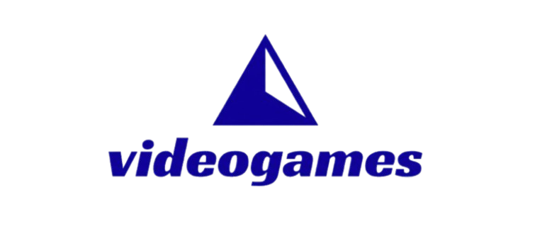

# 🎮 VideoGames Project - React Web App

 

  

  <h3 align="center">Project Web with React</h3>

  

    A dynamic and responsive React application for LND class.
     
    <a href="https://github.com/tu-usuario/tu-repo"><strong>Explore the docs »</strong></a>
     
     
    <a href="https://github.com/tu-usuario/tu-repo/issues">Report Bug</a>
    ·
    <a href="https://github.com/tu-usuario/tu-repo/issues">Request Feature</a>
  

---

## 📝 Description
This project is a modern web application built with **React**. The main objective is to show the work that us,the students made these weeks. 

The home page has a simple view with the site's services, a header with the site's logo, and buttons to navigate through the pages.

---

## 🛠️ Third-Party Components
The following libraries and components were used to enhance the application:

* **[React Router Dom](https://reactrouter.com/):** Used for seamless navigation between Home, Gallery, and Contact pages without refreshing the browser.
* **[Font Awesome](https://fontawesome.com/):** For the high-quality social media icons located in the footer.

---

## 📚 Resources & Tutorials
These resources were instrumental in the development of this project:

* **[Best-README-Template](https://github.com/othneildrew/Best-README-Template):** Used as a structural guide for this documentation.
* **[React Documentation](https://react.dev/):** For understanding hooks and component lifecycle.
* **[CSS Grid Guide by CSS-Tricks](https://css-tricks.com/snippets/css/complete-guide-grid/):** Essential for creating the responsive gallery layout.
* **[W3Schools Font Awesome Tutorial](https://www.w3schools.com/icons/fontawesome5_intro.asp):** To correctly integrate icons in the footer.

---

## 🚀 Getting Started

### Prerequisites
Make sure you have **Node.js** installed on your machine.

### Installation
1. Clone the repo:
   git clone [https://github.com/vinssoke/videogames-project.git]

2. Install npm install in your git bash

3. Run the command npm run dev
